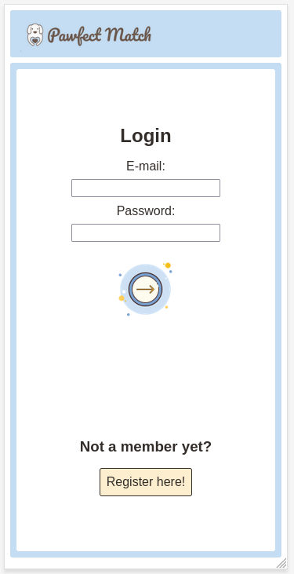

# Pawfect Match

Pawfect match is an application that is designed for dog owners to find play mates for their dogs. App recommends profiles to each other using biographical data points, user's location and preferences. App also offers users a possibility to chat with users they are connected with.

## 1. Setting up the environment

Pawfect match app is run by using Docker container. This means that Docker is the only software needed to install to start using the app.

Docker can be installed from the website below:

```
https://www.docker.com/get-started/
```

Follow the instructions on the website to install Docker on your computer.

## 2. Run the server

Run the server with the command `docker compose up`. Pawfect Match runs on port 8080.  
When you execute the command, it may take few minutes to set up the Docker container at the first time.


```
Empty database or mock users database?
```

Server is up when this message is shown in the terminal:

```
Message?
```

Server is shut down by pressing `ctrl` + `C` in the terminal.

## 3. Interface usage

When server is up and running, go to your browser and type `localhost:8080` to the address bar and press enter. Interface is now open and you can see the login page.

### Login

In login page user has options to register as a new user or login using e-mail and password.



### Register

In register page new user should give information about their dog and their preferences related to the dogs they should be matched with. User can also choose if they want to use their live location to find matches from or pick a city from a list. After successfull registeration, user will be redirected back to login page where they can login to their new account.

### Recommendations

After succesfully logging in 


