# 🐾 Pawfect Match

Pawfect match is an application that is designed for dog owners to find playmates for their dogs. App recommends profiles to each other using biographical data points, user's location and preferences. App also offers users a possibility to chat with users they are connected with.

## Live Demo

https://pawfectmatch.diy

## Tech Stack

- Frontend: React, JavaScript, HTML, CSS
- Backend: Go (Golang), Gorilla WebSocket, raw SQL queries
- Database: PostgreSQL + PostGIS
- DevOps: Docker, Docker Compose, Nginx (reverse proxy)
- Architecture: REST API + WebSocket (real-time chat)

## My Contribution

- Building a RESTful API and implementing real-time chat using Gorilla WebSocket
- Designing the entire database schema (ERD) and writing raw SQL queries, including spatial queries with PostGIS
- Developing custom JWT-based authentication and session management logic (used bcrypt for password hashing)
- Setting up the full Docker-based development environment
- Configuring Nginx as a reverse proxy to connect the frontend and backend
- Closely collaborating with the frontend developer to align on API structure and UX flows
- Additionally contributed to frontend by implementing the user profile view component

## What I Learned

- Learned how to manage real-time data flow using Gorilla WebSocket, including the use of goroutines and mutexes for concurrent event handling
- Gained hands-on experience designing spatial queries with PostGIS and trigger-based geolocation updates
- Deepened my understanding of secure session management by implementing JWT authentication and bcrypt-based password hashing
- Gained practical insight into HTTP-only cookies and how to deliver and validate tokens securely via custom middleware
- Strengthened backend–frontend communication by aligning API behavior with frontend UX requirements
- Gained hands-on experience creating responsive, component-based UIs using React

## What I Would Improve

- Add support for image and file sharing in the chat interface
- Add another layer of protection by requiring verified emails and complex passwords
- Add automated testing and a CI/CD pipeline to improve development speed and reliability

## ERD

Entity-relationship diagram of the database schema used in Pawfect Match.
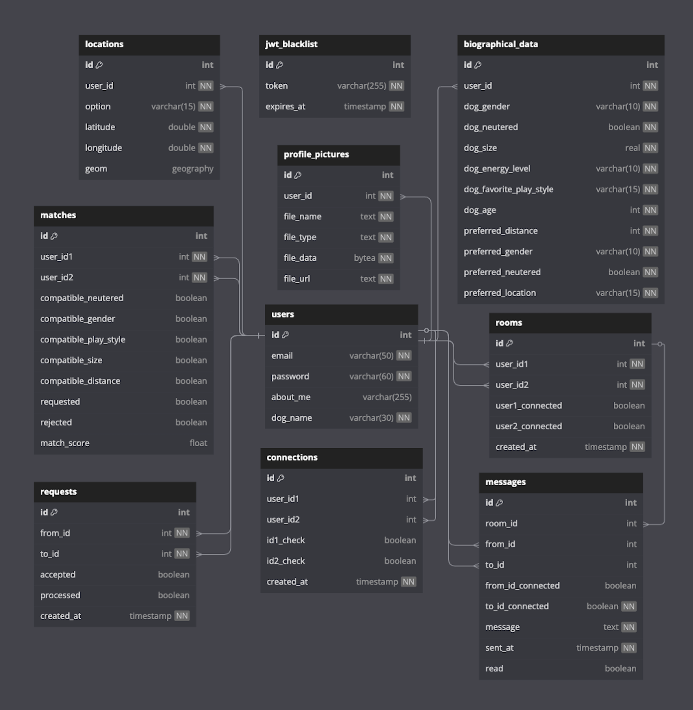

## User Flow

Overview of the main user journey and screen transitions in the app.

## App Screens & Features

This project was built as a responsive web application, optimized for use across various devices including desktops, tablets, and smartphones.

### Login

In the login page the user has options to register as a new user or login using email and password.

### Register

In the register page new user should give information about their dog and their preferences related to the dogs they should be matched with. Users can also choose if they want to use their live location to find matches from or pick a city from a list. After successful registration, users will be redirected back to the login page where they can login to their new account.

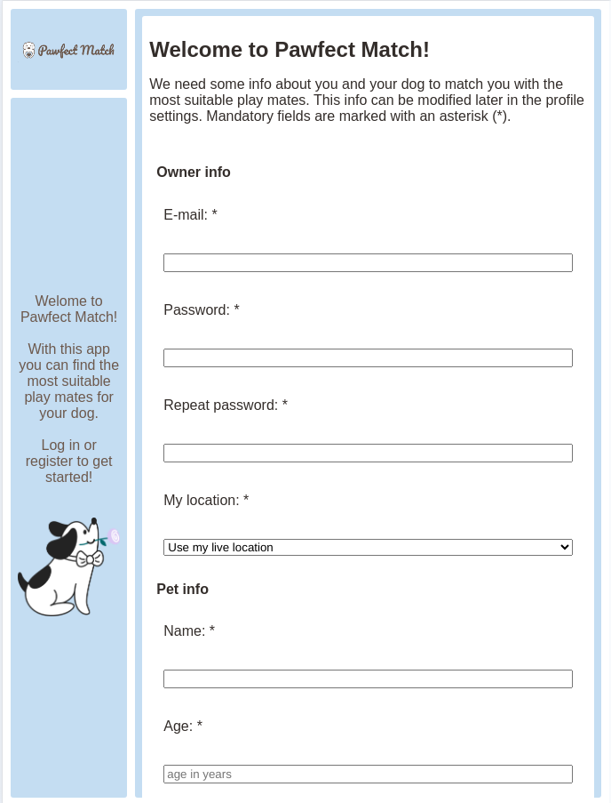

### Page navigation

Navigation is made easy: Navigation buttons are located on the left side panel (in desktop or mobile landscape view) or on the bottom of the page (in mobile portrait view).  
Connections and messages icons will show a red notification mark if the user has new messages or connection requests.

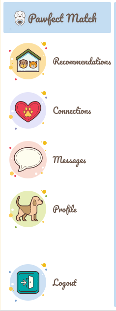

### Recommendations

After successfully logging in, users will be redirected to the recommendations page. If the user has live location enabled, the browser asks permission to use location. This should be accepted for recommendations to work properly. User's live location (if used) and recommendations are then updated. Because updating and calculating coordinates is a heavy task for the database, updating recommendations especially for live location users may take a few seconds.

The page shows a maximum of 10 recommended users. Best matches are seen on the top. By pressing the profile picture, the user can navigate to that user's profile page.

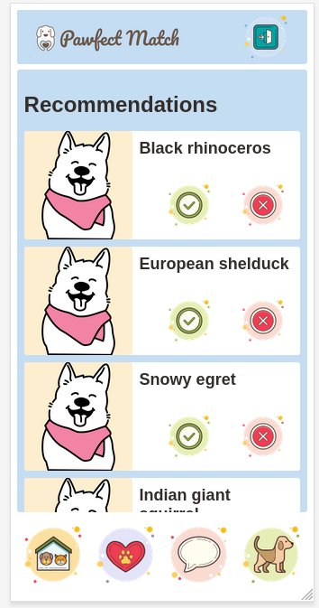

### Profile page

Profile page can be accessed by pressing the user's profile-picture in recommendations, connection or messages. Profile page shows Dog's name, profile picture, "about me and my owner" -text and dog's bio information. If the user is connected with the profile, the profile page also shows the user's online status and chat-icon. By pressing the chat icon, the user can navigate to the chat with this user.

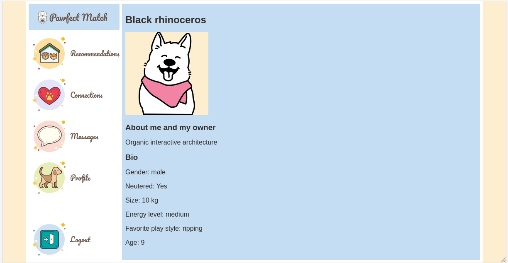

### Connections

The connections page shows new pending connection requests and current connections. In this page user can:

1. Navigate to user's profile by pressing profile picture
2. Accept or decline pending connection request
3. Remove existing connection

Online status is shown for current connections.

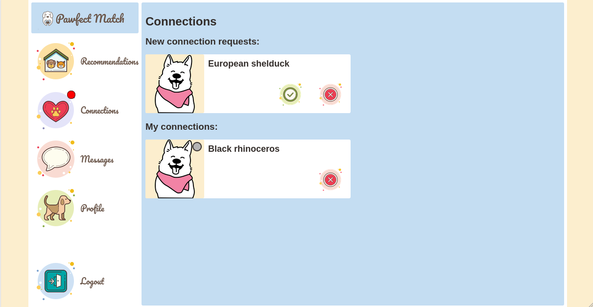

### Messages

Messages page shows list of user's chats. Notification mark is visible if the chat has unread messages.  
Users can open the chat by pressing the chat icon in the user's card. Also users' online status is visible in users' profile pictures.

Chats are ordered by most recent activity. Note that when a new connection is made chat is automatically created for the users. The new chat shows at the top of the messages chatlist view (until new messages are received for some other chat).

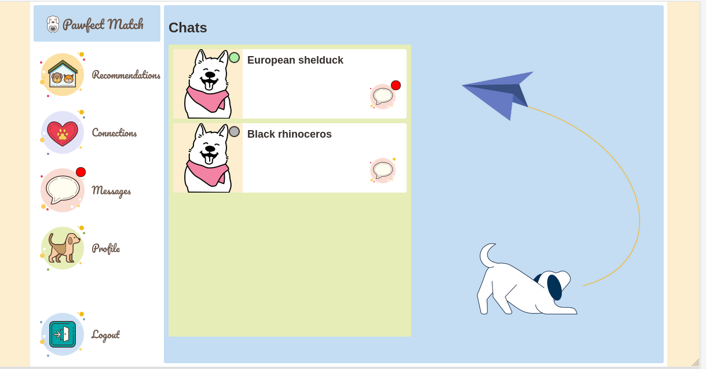

### Chat

Top of the chat page shows the user's name, online status and "writing..." message when the other user is writing something to you. User has also a possibility to navigate back to the messages page using the arrow.

Messages with dates and times can be seen in the middle of the page: green ones are other user's messages and pink ones are your messages. Messages are loaded max 10 at the time. If chat history contains more than 10 messages, more messages are loaded when the user scrolls to the top of the white box where messages are located. New incoming messages can be seen on the bottom of the messages box.

Messages can be sent using the yellow box and send-button at the bottom of the page.

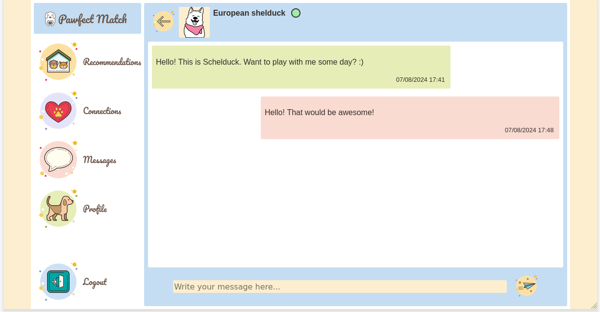

### Own profile page

Own profile page shows the user's current profile information and preferences. It also has "edit profile"-button on the top right corner.

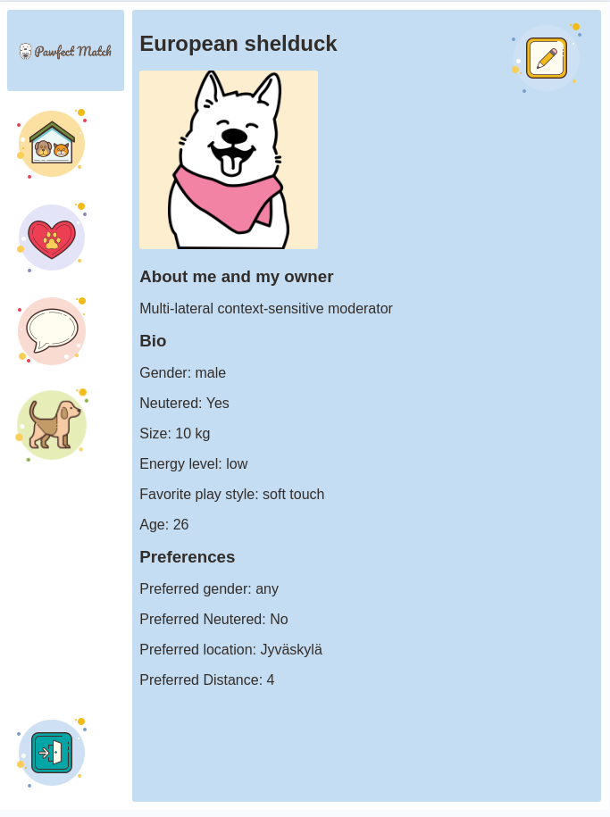

### Edit profile page

Edit profile page has similar structure to registration page, except users can change their password in the edit profile page if they wish. Users should change the information they wish to change and then save the data using the "save"-button at the bottom of the page.

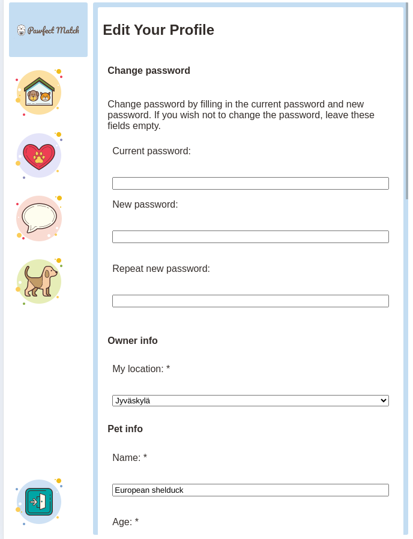

## Matching algorithm

Matching algorithm calculates points for each dog pair according to these principles:

- A dog is not recommended to play with another dog that is two size categories larger. Dogs with similar size get more points.
- Dogs are not recommended in any case if they don't match each others location/gender/neuter preference
- Dogs with similar play styles get higher recommendation points.  
  For example: lonely wolf play style get points by play style like this:
  - lonely wolf: +7 points
  - soft touch: +5 points
  - cheerleading: +3 points
- Dogs with similar energy level get more points
- Dogs within the same age range get more points

## Local Development

If you'd like to run the project locally instead of using the demo link:

1. Clone the repository
2. Make sure Docker is installed
3. Run the following:

Pawfect match app is run by using Docker containers. This means that Docker is the only software needed to install to start using the app.

### Commands to run the server using Docker

Servers are run by using the commands below. Commands should be used while located in the root directory of the project. If you are a Linux user, you might need to run these commands as sudo.

#### `docker compose up --build`

This command is used when building containers with new data (changing database or if there are some changes made to the code during review). This command also starts the servers. When you execute this command, it may take a few minutes to set up the Docker containers.

When the process is ready, your terminal might show something similar to this:

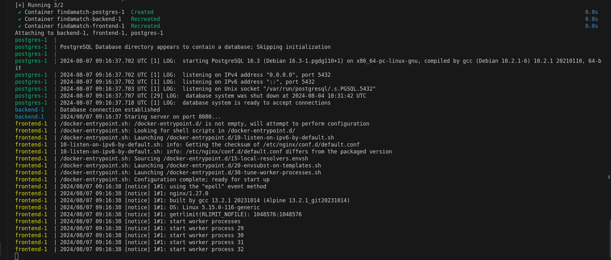

#### `docker compose up`

This command is used to start the servers using the previous data setting.

After running the project locally, you can access it at:

🔗 **http://localhost:3000**

The database includes approximately **100 mock user profiles** for testing the full functionality of the app.

#### `docker compose down -v`

This command deletes the volumes and containers previously used. Use this command if you want to remove the users you created to the database and also when changing from between empty database and mock user database. If run in another terminal while Docker is running, this command will also stop the servers.

#### `docker compose down`

If run from another terminal, this command stops the servers. The data you added to the database is stored.

#### `ctrl` + `C`

Using this keyboard combination in the terminal where the servers are running you can stop the servers. The data you added to the database is stored.

## License

This project is licensed under the MIT License.
See the [LICENSE](./LICENSE) file for details.
