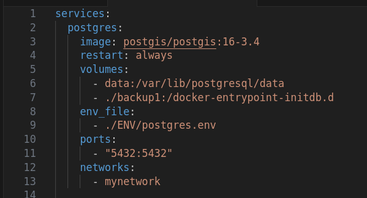

# Pawfect Match

Pawfect match is an application that is designed for dog owners to find play mates for their dogs. App recommends profiles to each other using biographical data points, user's location and preferences. App also offers users a possibility to chat with users they are connected with.

## 1. Setting up the environment

Pawfect match app is run by using Docker container. This means that Docker is the only software needed to install to start using the app.

Docker can be installed from the website below:

```
https://www.docker.com/get-started/
```

Follow the instructions on the website to install Docker on your computer.

## 2. Testing with Docker

The program runs in 3 containers:

1. Backend runs in it's own docker container on port 8080. 
2. Frontend runs in it's own container and on port 3000.
3. Postgres database runs in it's own container and uses port 5432.

### Commands to run the server using Docker

Servers are run by using these commands. Commands shoul be used while located in the root directory of the project. If you are a Linux user, you might need to run these commands as sudo.

#### `docker compose up --build` 

This command is used when building containers with new data (changing database or if there are some changes made to the code during review). This command also starts the servers. When you execute this command, it may take few minutes to set up the Docker container.

When the process is ready, your terminal might show something similar to this:


#### `docker compose up` 

This command is used to start the servers using previous data setting.

#### `docker compose down -v` 

This command deletes the volumes and containers previously used. Use this command if you want to remove the users you created to the databse and also when changing from between empty database and mock user databse. If run in other terminal while Docker is running, this command will also stop the servers.

#### `docker compose down`

If run from other terminal, this command stops the servers. The data you added to the database is stored.

#### `ctrl` + `C`

Using this keyboard combination in the terminal where the servers are running you can stop the servers. The data you added to the database is stored.

#### Mock user database

By default Docker is configured to use an empty database. When you want to test the program with 100 mock users, you should change volume in `docker-compose.yaml`-file to backup2. So change row 7 in the file to: 

`- ./backup2:/docker-entrypoint-initdb.d`



Remember to remove previous volumes with `docker compose down -v` and build the containers again with `docker compose up --build` when changing from empty database to mock user database and vice versa. Note that after changing the database setting the accounts you created to the previous database do not exist anymore. You may also want to clean up cookies from your browser after changing database. 

If you wish to sign in to mock user's account, you can find their e-mail-addresses and passwords in `backup2/mock_user_data.json` file.

#### Other tips for testing

If you wish to sign in to multiple accounts at the same time, you should use different devices, different browsers or same browser in incognito mode to do so. Otherwise the cookies are shared between the two windows/tabs of the same browser and user authentication is not successfull for multiple users at the same time. 

You can use browser's developer tools' responsive design mode to test how the app would look like in a mobile phone.

PC's browser location is not always 100% accurate. If you test the live location feature you can check what location is sent by visiting for example:  
https://bestvpn.org/html5demos/geo/ 

## 3. Interface usage

When server is up and running, go to your browser and type `localhost:3000` to the address bar and press enter. Interface is now open and you can see the login page.

### Login

In login page user has options to register as a new user or login using e-mail and password.


### Register

In register page new user should give information about their dog and their preferences related to the dogs they should be matched with. User can also choose if they want to use their live location to find matches from or pick a city from a list. After successfull registeration, user will be redirected back to login page where they can login to their new account.


### Page navigation

Navigation is made easy: Navigation buttons are located on the left side panel (in desktop or mobile landscape view) or on the bottom of the page (in mobile portrait view).  
Connections and messages icons will show a red notification mark if user has new messages or connection requests.


### Recommendations

After succesfully logging in user will be redirected to recommendations page. If user has live location enabled, browser asks permission to use location. This should be accepted for recommendations to work properly. User's live location (if used) and recommendations are then updated. Because updating and calculating coordinates is heavy task for the database, updating recommendations especially for live location users may take few seconds.

The page shows maximum of 10 recommended users. Best matches are seen on the top. By pressing the profile picture user can navigate to that user's profile page.


### Profile page

Profile page can be accessed by pressing user's profile-picture in recommendations, connection or messages. Profile page shows Dog's name, profile picture, "about me and my owner" -data and dog's bio information. If user is connected with the profile, profile also shows user's online status and chat-icon. By pressing the chat icon user can navigate to the chat with this user.


### Connections

Connections page shows new pending connection requests and current connections. In this page user can:

1. Navigate to user's profile by pressing profile picture
2. Accept or decline pending connection request
3. Remove existing connection

Online status is shown for current connections.


### Messages

Messages page show list of user's chats. Notification mark is visible if the chat has unread messages.  
User can open the chat by pressing the chat icon in user's card. Also users' online status is visible in users' profile pictures.

Chats are ordered by most recent activity. Note that when new connection is made chat is automatically created for the users. The new chat shows at the top of the messages chatlist view (until new messages are received  for some other chat).


### Chat

Top of the chat page shows user's name, online status and "writing..." message when the other user is writing something to you. User has also a possibity to navigate back to messages page using the arrow.

Messages with dates and times can be seen in the middle of the page: green ones are other user's messages and pink ones are your messages. Messages are loaded max 10 at the time. If chat history conatins more than 10 messages, more messages are loaded when user scrolls to the top of the white box where messages are located. New messages can be seen on the bottom of the messages box.

Messages can be sent using the yellow box and send-button at the bottom of the page.


### Own profile page

Own profile page shows user's current profile information. It also has "edit profile"-button on the top right corner.


### Edit profile page

Edit profile page has similar structure to registeration page, except user can change their passwors in the edit profile page if they wish. User shoul change the information they wish to change and then save the data using the "save"-button at the bottom of the page.


## Matching algorithm

Matching algorithm calcultes points for each dog pair according to these principles:

- A dog is not recommended to play with another dog that is two size categories larger. Dogs with similar size get more points.
- Dogs are not recommended in any case if they don't match each others location/gender/neuter preference
- Dogs with similar playstyles get higher recommendation points. For example:  
    lonely wolf play style get points by play style like this:   
    lonely wolf 7   
    soft touch 5   
    cheerleading 3  
-  Dogs with similar energy level get more points
- Dogs within the same age range get more points


